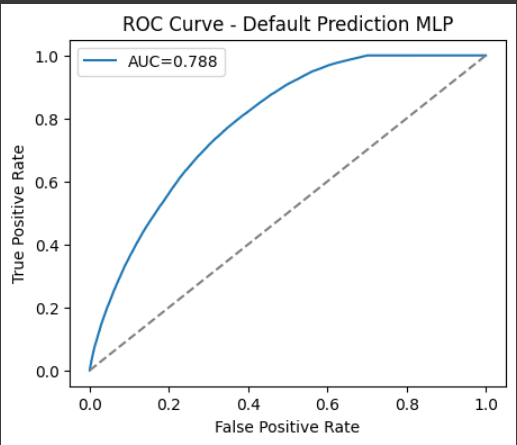

# Policy Optimization for Financial Decision-Making

This project demonstrates an **end-to-end pipeline** combining **Supervised Deep Learning** and **Offline Reinforcement Learning (RL)** to optimize **loan approval decisions** in a real-world financial context.

---

## 📈 Objective

The goal is to design an intelligent system that decides **whether to approve or deny a new loan** to **maximize profit while minimizing risk**.  
This project mirrors the work of a **FinTech Research Scientist** using ML + RL for credit decision-making.

**Skills demonstrated:**
- Data analysis & feature engineering  
- Building and evaluating deep learning models  
- Framing supervised learning as an **offline RL** problem  
- Applying CQL (Conservative Q-Learning) for policy optimization  
- Interpreting, comparing, and communicating model behaviors  

---

## 🧩 Dataset — LendingClub Loan Data

**Source:** [Kaggle – Lending Club Loan Data (2007–2018)](https://www.kaggle.com/datasets/wordsforthewise/lending-club)

- Contains borrower info, loan details, and repayment outcomes.  
- Focus file: `accepted_2007_to_2018Q4.csv`  
- Target variable: **loan_status**  
  - `0 → Fully Paid`  
  - `1 → Defaulted / Charged Off`

> ⚠️ The full dataset is large (1GB+).  
> Download it manually from Kaggle and place it in `/data/`.

---

## 🧠 Core Tasks

### **Task 1 — Exploratory Data Analysis (EDA) & Preprocessing**
- Cleaned and analyzed key variables (`loan_amnt`, `int_rate`, `annual_inc`, `dti`, etc.)
- Encoded categorical features (`grade`, `purpose`, etc.)
- Standardized numeric values and removed outliers.
- Output: `processed_loan_data.csv`

📓 Notebook → `notebooks/01_EDA_and_Preprocessing.ipynb`

---

### **Task 2 — Model 1: Supervised Deep Learning Classifier**

Built a **3-layer MLP** to predict loan default probability.

| Layer | Units | Activation | Params |
|--------|--------|------------|---------|
| Dense | 256 | ReLU | 10,752 |
| BatchNorm | - | - | 1,024 |
| Dropout | - | 0.3 | 0 |
| Dense | 128 | ReLU | 32,896 |
| BatchNorm | - | - | 512 |
| Dropout | - | 0.3 | 0 |
| Dense | 64 | ReLU | 8,256 |
| BatchNorm | - | - | 256 |
| Dropout | - | 0.3 | 0 |
| Dense | 1 | Sigmoid | 65 |

**Optimizer:** Adam (lr=1e-3)  
**Loss:** Binary Crossentropy  
**Total params:** 53,761  

📄 Model saved → `models/keras_default_pred.h5`

#### 🎯 Performance Metrics
| Metric | Value |
|---------|--------|
| **AUC** | **0.788** |
| Accuracy | 0.81 |
| F1-score | 0.71 |

  

📓 Notebook → `notebooks/02_Supervised_DL_Model.ipynb`

---

### **Task 3 — Model 2: Offline Reinforcement Learning Agent**

Framed as an **Offline RL Problem** using the same dataset.

#### Environment Setup
| Component | Definition |
|------------|-------------|
| **State (s)** | Borrower feature vector |
| **Action (a)** | {0: Deny, 1: Approve} |
| **Reward (r)** | Engineered profit/loss: |
| - Deny | 0 |
| - Approve + Paid | + (loan_amnt × int_rate) |
| - Approve + Default | – loan_amnt |

#### Algorithm Details
- **Algorithm:** Conservative Q-Learning (CQL)  
- **Framework:** [d3rlpy](https://github.com/takuseno/d3rlpy)  
- **Backend:** PyTorch  
- **Parameters:** learning_rate=1e-4, batch_size=256, gamma=0.99  

📦 Model saved → `models/discrete_cql_model/`  
📓 Notebook → `notebooks/03_Offline_RL_Agent.ipynb`

---

## 🧮 Comparative Analysis

| Model | Metric | Interpretation |
|--------|---------|----------------|
| **MLP Classifier** | AUC = 0.788 | Predicts borrower default risk |
| **CQL RL Agent** | Estimated Policy Value ↑ | Learns optimal approval strategy |

**Insights**
- Deep Learning focuses on minimizing classification error.  
- RL focuses on maximizing *expected profit*.  
- RL may approve “high-risk” loans if expected reward > 0.  
- RL directly optimizes business return rather than accuracy.

---
# 🚀 Reproducibility & Setup

1️⃣ **Clone Repository**
git clone https://github.com/gargmukul91066/Policy-Optimization-for-Financial-Decision-Making.git  
cd Policy-Optimization-for-Financial-Decision-Making  

---

2️⃣ **Create Environment**
conda create -n policyopt python=3.10 -y  
conda activate policyopt  
pip install -r requirements/requirements.txt  

---

3️⃣ **Add Dataset**  
Download from Kaggle and place inside `/data/`:  
data/accepted_2007_to_2018Q4.csv  

---

4️⃣ **Run Pipeline**
# Step 1 – Preprocessing  
jupyter notebook notebooks/01_EDA_and_Preprocessing.ipynb  

# Step 2 – Supervised DL Model  
jupyter notebook notebooks/02_Supervised_DL_Model.ipynb  

# Step 3 – Offline RL Agent  
jupyter notebook notebooks/03_Offline_RL_Agent.ipynb  

---

## 🧾 Requirements
pandas==2.1.4  
numpy==1.24.3  
scikit-learn==1.2.2  
imbalanced-learn==0.10.1  
matplotlib==3.8.0  
seaborn==0.12.2  
tensorflow==2.13.0  
torch==2.1.0  
d3rlpy==2.8.1  

---

## 📊 Repository Structure
Policy-Optimization-for-Financial-Decision-Making/  
│  
├── data/  
│   ├── processed_loan_data.csv  
│   ├── test_predictions.csv  
│   └── README.md  
│  
├── models/  
│   ├── keras_default_pred.h5  
│   ├── discrete_cql_model/  
│   └── cql_model_stabilized/  
│  
├── notebooks/  
│   ├── 01_EDA_and_Preprocessing.ipynb  
│   ├── 02_Supervised_DL_Model.ipynb  
│   └── 03_Offline_RL_Agent.ipynb  
│  
├── results/  
│   ├── ROC_Curve_Default_Prediction.png  
│   ├── Model_Summary_MLP.png  
│   └── metrics_summary.png 
│  
├── requirements/  
│   └── requirements.txt  
│  
├── LICENSE  
└── README.md  

---

## 🧠 Key Takeaways  
- Deep Learning → Risk Assessment  
- Offline RL → Decision Optimization  
- Combined Approach → Profit-Maximizing Credit Policy  

---

## 👤 Author  
**Mukul Garg**  
📧 LinkedIn | GitHub  

---

## 🪪 License  
This project is licensed under the Apache License 2.0.  
See LICENSE for details.

